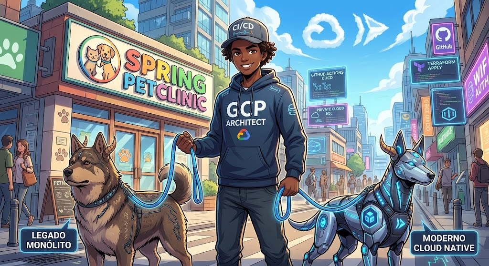

# Enterprise Java Legacy App Modernization

<div align="center">
  

  <h1>Spring Boot Infra Modernization </h1>

</div>

<br>
<div align="center">
  
  
  
  
  
  
</div>

**Modernizing a legacy Spring Boot monolith (Spring PetClinic) onto Google Cloud — without rewriting its business logic.**

---

## Motivation

Legacy Java apps are expensive to operate: little reproducibility, manual
deploys, invisible observability, weak security gates. This repository
demonstrates a modernization path that keeps the business logic untouched while
wrapping it in an enterprise-grade platform: Cloud Run + Cloud SQL + IaC +
DevSecOps.

## Target architecture

```
 Developer ── git push ──► GitHub Actions CI ──► Terraform apply ──► GCP
                              │ (SAST · IaC scan · image scan)
                              ▼
                  ┌──────────────────────────────┐
                  │ Global External HTTP(S) LB   │
                  └──────────────┬───────────────┘
                                 │
                         ┌───────▼───────┐
                         │   Cloud Run    │  (internal ingress)
                         └───────┬───────┘
                   Direct VPC egress │ private IP
                         ┌───────▼───────┐
                         │  Cloud SQL     │  PostgreSQL (private)
                         └───────────────┘
              VPC · Secret Manager · IAM · Artifact Registry · Monitoring
```

## What was done

1. **Baseline** — captured the current state and made it reproducible locally
   (`docker-compose` + Buildpacks). Business logic untouched.
2. **Containerization** — OCI image via Buildpacks (no Dockerfile).
3. **Enterprise target (IaC)** — Terraform for networking/security, compute,
   data, secrets, IAM and monitoring.
4. **Observability** — Prometheus metrics + OpenTelemetry tracing.
5. **DevSecOps** — one CI/CD pipeline: SAST (SpotBugs) → IaC scan (Trivy) →
   image scan (Trivy) → deploy (WIF, keyless).

## Why each choice

- **Cloud Run (over GKE)** — a fully managed serverless runtime that runs the
  existing container with zero cluster operations, right-sized for a single
  HTTP monolith.
- **Cloud SQL PostgreSQL (private IP)** — a managed database reachable only over
  the private network, never a public IP.
- **Global External HTTP(S) LB** — one global anycast entrypoint that fronts the
  serverless NEG.
- **VPC + Direct VPC egress** — isolates the app and routes its egress through a
  private subnet to reach Cloud SQL.
- **Terraform (GCS remote state)** — Git as the source of truth, with remote and
  locked state for safe collaboration.
- **Secret Manager** — keeps the database password out of Git and injects it at
  runtime.
- **Workload Identity Federation** — keyless CI auth, no service-account keys to
  rotate or leak.
- **GitHub Actions** — a single pipeline for the whole shift-left flow.
- **SpotBugs + Trivy** — SAST and IaC/container scans that fail the build on
  high/critical findings.
- **Prometheus + OpenTelemetry** — metrics and traces so the app is observable
  from day one.
- **Buildpacks** — builds the OCI image with no Dockerfile to maintain.
- **Cloud Armor (deferred)** — the SQLi/XSS WAF is documented but not provisioned
  because the project's security-policy quota is 0.

## Repository structure

```
├── src/                          # Spring PetClinic source (business logic unchanged)
├── terraform/                    # GCP infrastructure as code
│   ├── providers.tf              #   remote backend (GCS) + google provider
│   ├── variables.tf              #   project, region, versions, image tag
│   ├── network.tf                #   VPC, subnet, peering, firewall (5432)
│   ├── database.tf               #   Cloud SQL PostgreSQL (private IP)
│   ├── app.tf                    #   Cloud Run service (internal ingress)
│   ├── loadbalancer.tf           #   NEG, backend, URL map, proxy, forwarding rule
│   ├── artifact_registry.tf      #   Docker repository
│   ├── secrets.tf                #   Secret Manager + random password
│   ├── iam.tf                    #   service account + IAM bindings
│   └── monitoring.tf             #   Cloud Monitoring dashboard
├── .github/workflows/ci-cd.yml   # CI/CD pipeline (SAST + Trivy scans + deploy)
├── docs/                         # architecture.md + ADRs
├── docker-compose.yml            # local baseline (Postgres + app)
└── experiments/baseline/         # how to build/test/run locally
```

## Lab / proof of concept

This repository is a **lab / proof of concept**, not a production deployment. It
demonstrates the modernization path end-to-end. Production would additionally
enable Cloud Armor WAF, terminate TLS with a managed certificate (HTTPS), and
tighten IAM to least-privilege.
