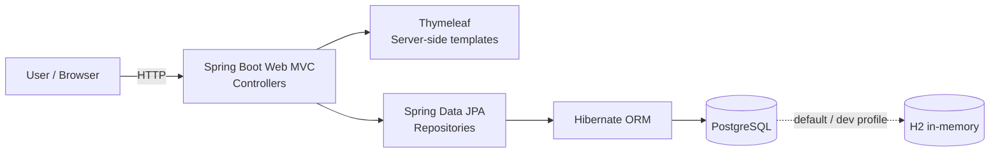

# Architecture (Current State)

This document describes the **current-state** architecture of the application as
it exists in this phase. It intentionally does not describe any future Google
Cloud target architecture.

## Overview

The application is the Spring PetClinic sample application: a single,
HTTP-based Spring Boot monolith that renders server-side HTML using Thymeleaf
and persists data using Spring Data JPA / Hibernate.

## Architecture

### Request flow

1. A user issues an HTTP request to the browser-facing web layer.
2. Spring Boot Web MVC dispatches the request to a controller.
3. Controllers read/write domain objects through Spring Data JPA repositories.
4. Hibernate translates the persistence operations into SQL against the
   configured database.
5. Responses are rendered server-side via Thymeleaf templates.

## Layers

| Layer | Package(s) | Responsibility |
|-------|------------|----------------|
| Web (MVC + Thymeleaf) | `system`, `owner`, `vet` controllers | HTTP handling and server-side rendering |
| Domain model | `model`, `owner`, `vet` | JPA entities and validation |
| Data access | `owner` / `vet` repositories | Spring Data JPA repository interfaces |
| Infrastructure | `system` | Caching (`CacheConfiguration`), web config, welcome page |

## Technology stack

- **Language / runtime**: Java 17
- **Application framework**: Spring Boot (Web MVC, Validation, Actuator, Cache)
- **View technology**: Thymeleaf (server-side rendering)
- **Persistence**: Spring Data JPA + Hibernate ORM
- **Database**: PostgreSQL (via `postgres` profile); H2 in-memory (default);
  MySQL also supported
- **Caching**: JCache API backed by Caffeine (`vets` cache)
- **Build tool**: Maven (Maven Wrapper)

## Database

- The application uses Spring's SQL init to apply
  `src/main/resources/db/<database>/schema.sql` and `data.sql` at startup.
- The active database is selected via the `database` property, which the
  `postgres` profile sets to `postgres`.
- `spring.jpa.hibernate.ddl-auto=none` means the schema is managed by the SQL
  scripts, not by Hibernate.

## Configuration profiles

| Profile | File | Database |
|---------|------|----------|
| *(default)* | `application.properties` | H2 (in-memory) |
| `postgres` | `application-postgres.properties` | PostgreSQL |
| `mysql` | `application-mysql.properties` | MySQL |

## Deployment model

The application is a single deployable unit (a Spring Boot executable JAR). It
is not split into microservices and does not require Kubernetes.
