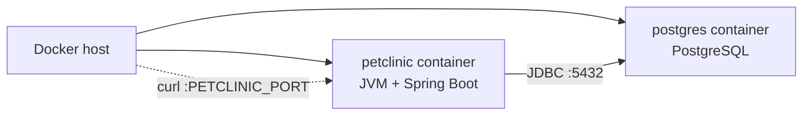

# Baseline — Spring PetClinic Local Environment

This document captures the reproducible local baseline for the Spring PetClinic
application: how it is built, tested, containerized, and run locally against
PostgreSQL, without changing its business behavior.

## Application runtime

- **Application**: Spring PetClinic (sample Spring Boot application)
- **Framework**: Spring Boot (web MVC, server-side rendered with Thymeleaf)
- **Language**: Java
- **Java version**: 17 (minimum; build is pinned to Java 17)
- **Build tool**: Maven (via the included Maven Wrapper, `./mvnw`)

## Database technology

- **Primary local database (this phase)**: PostgreSQL
- **Default/development database (bundled)**: H2 (in-memory)
- **Also supported**: MySQL

The data layer uses Spring Data JPA / Hibernate. Schema and seed data are
managed through SQL scripts under `src/main/resources/db/<database>/` and are
applied at startup via `spring.sql.init` (`schema.sql` + `data.sql`).

## How to run tests

```bash
./mvnw test
```

The default test suite uses the in-memory H2 database. Database-specific
integration tests are also present:

- `PostgresIntegrationTests` — runs against PostgreSQL via Docker Compose
  (skipped automatically when Docker is unavailable).
- `MySqlIntegrationTests` — runs against MySQL via Testcontainers
  (skipped automatically when Docker is unavailable).

## Container image build mechanism

The OCI image is built with Spring Boot's native Buildpacks support (no
Dockerfile). The image name is configured in `pom.xml`
(`spring-boot-maven-plugin` -> `image.name`):

```bash
./mvnw spring-boot:build-image
```

This produces the image `spring-petclinic:local` (see `.env.example` for the
`PETCLINIC_IMAGE` variable).

## Startup command

The full local stack (PostgreSQL + PetClinic) is started with Docker Compose:

```bash
# 1. prepare the local environment file (git-ignored)
cp .env.example .env   # then set POSTGRES_PASSWORD in .env

# 2. build the image (first time / after code changes)
./mvnw spring-boot:build-image

# 3. start the stack
docker compose up -d
```

The stack can be stopped with `docker compose down`.

## Local network topology



Both containers are placed on the same Docker Compose default network. The
PetClinic container reaches PostgreSQL using the Compose **service name**
`postgres` (not `localhost`).

## Runtime contract

### Configuration (non-secret)

| Item | Value | How it is provided |
|------|-------|--------------------|
| Spring profile | `postgres` | `SPRING_PROFILES_ACTIVE=postgres` |
| Application listening port | `8080` (container) | `SERVER_PORT` env var (default `8080`) |
| Host port mapping | `PETCLINIC_PORT` (default `8080`) | `docker-compose.yml` ports |
| Database hostname | `postgres` (service name) | `POSTGRES_URL=jdbc:postgresql://postgres:5432/<db>` |
| Database port | `5432` (container internal) | part of `POSTGRES_URL` |
| Database name | `petclinic` | `POSTGRES_DB` env var |
| Database username | `petclinic` | `POSTGRES_USER` env var |
| Container image | `spring-petclinic:local` | `PETCLINIC_IMAGE` env var |
| Health endpoint | `/actuator/health` | Actuator (`management.endpoints.web.exposure.include=*`) |

### Secrets (not committed)

| Item | How it is provided |
|------|--------------------|
| Database password | `POSTGRES_PASS` (application) / `POSTGRES_PASSWORD` (PostgreSQL container) env vars |

The password is supplied exclusively through environment variables, sourced
from a git-ignored `.env` file (see `.env.example`). The actual password is not
committed to source control and is not documented here.

## Application URL

- <http://localhost:8080/> (health: <http://localhost:8080/actuator/health>)

## Known assumptions

- Java 17 or newer is required; the project is currently built and run with
  Java 17.
- The application remains functionally unchanged; no business logic, domain
  model, controllers, or repositories were modified.
- The PostgreSQL container has no persistent volume in this phase; data is
  re-seeded on startup from `schema.sql`/`data.sql`.
- No GCP resources, Terraform, or CI/CD were introduced in this phase.
